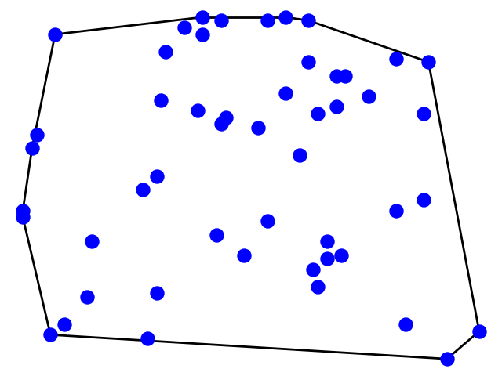

# Andrew's Monotone Chain Convex Hull Algorithm

The algorithm comes from [this page](https://en.wikibooks.org/wiki/Algorithm_Implementation/Geometry/Convex_hull/Monotone_chain#Python).

Output example with ```50``` vertices :


